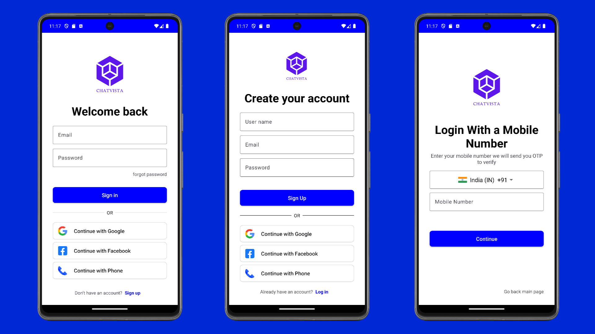
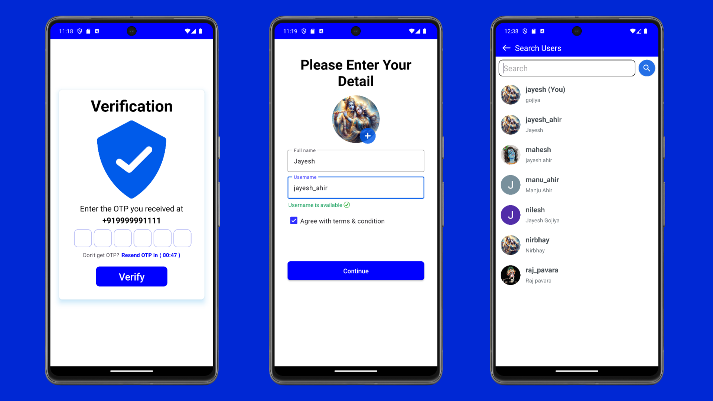
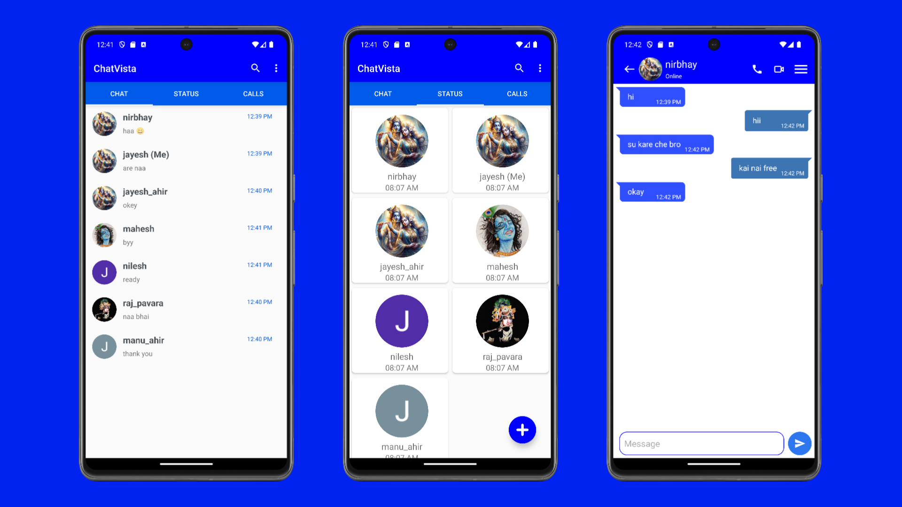

# Chat Vista 🚀🌐📱

[](https://github.com/gojiyajayesh)
[](https://github.com/gojiyajayesh/ChatVista.git)
[](https://github.com/gojiyajayesh/ChatVista/stargazers)

## Description 🚀

Chat Vista is a robust and user-friendly chat application designed to provide a seamless communication experience similar to popular messaging apps like WhatsApp. Built using Android Studio, XML for UI, Java for UX, and Firebase for backend services, Chat Vista incorporates key features to enhance user interaction.

## Table of Contents📋

- [Chat Vista 🚀🌐📱](#chat-vista-)
  - [Description 🚀](#description-)
  - [Table of Contents📋](#table-of-contents)
  - [Installation ⚙](#installation-)
  - [Key Features 🔑](#key-features-)
  - [Usage📲](#usage)
  - [Contributing🤝](#contributing)
  - [Screenshots 📸](#screenshots-)
  - [Development Environment 🛠](#development-environment-)
  - [Testing 🧪](#testing-)
  - [Acknowledgments 🙌](#acknowledgments-)


## Installation ⚙

To run Chat Vista on your Android device, follow these steps:

1. Clone the repository:

   ```bash
   git clone https://github.com/gojiyajayesh/ChatVista.git
   ```
2. Open the project in Android Studio.
3. Set up Firebase for your project:
   - Go to the [Firebase Console](https://console.firebase.google.com/) and create a new project.
   - Follow the Firebase setup instructions and download the `google-services.json` file.
   - Place the `google-services.json` file in the `app` directory of your Android project.
4. Build and run the application on your Android device.

[Download Chat Vista APK](https://raw.githubusercontent.com/gojiyajayesh/ChatVista/main/AplFile/chavista.apk)

## Key Features 🔑

1. **Beautiful UI**:
   - Chat Vista boasts an attractive and intuitive user interface for an enhanced user experience.

2. **Authentication System**:
   - Users can sign in using Google, Facebook, mobile number, or email.
   - New users can register with Google, Facebook, mobile number, or email.
   - Unique username registration for connecting with other users.

3. **Profile Customization**:
   - Users can change their username, profile photo, and full name in the chat activity.

4. **Search and Connect**:
   - Users can search for familiar users and initiate chats seamlessly.

5. **Message Management**:
   - Delete for me and delete for everyone features for message management.

6. **User Profiles**:
   - View opposite users' profile photo, DP, and about section.

7. **Status Updates**:
   - Users can upload and view status updates from familiar users.

8. **Data Backup**:
   - If a user reinstalls Chat Vista and logs in with the same ID, all data is restored.


## Usage📲

1. Open Chat Vista on your Android device.
2. Sign in or register using Google, Facebook, mobile number, or email.
3. Customize your profile in the chat activity.
4. Search for familiar users and start chatting.
5. Explore features like message management, user profiles, and status updates.

## Contributing🤝

We welcome contributions to make Chat Vista even better! To contribute:

1. Fork the repository.
2. Create a new branch: git checkout -b feature-name.
3. Implement your changes and commit: git commit -m 'Description of the changes'.
4. Push to the branch: git push origin feature-name.
5. Submit a pull request.

## Screenshots 📸

<div class="slider">
  <div>
    
  </div>
  <div>
    
  </div>
  <div>
    
  </div>
</div>

## Development Environment 🛠

- Android Studio: Version 2023.2.1
- Firebase: Version v13.1.0
- Java: Version jdk-21
- XML: Version 1.1

## Testing 🧪

This app has been tested on Iqoo, vivo, and realme for Android versions 12, 13, and 14.

## Acknowledgments 🙌

We extend our sincere gratitude to JavaTpoint and ChatGPT for their valuable contributions to the development of Chat Vista. Their support, resources, and expertise have been instrumental in the creation and improvement of Chat Vista. Thank you for being a part of our journey towards success!
```

This README.md file now includes a download button for the Chat Vista APK file. You can copy and paste this content into your repository's README.md file. Make sure to replace the APK file URL with the actual URL of your file.